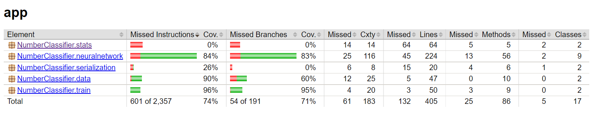
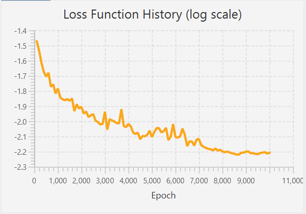
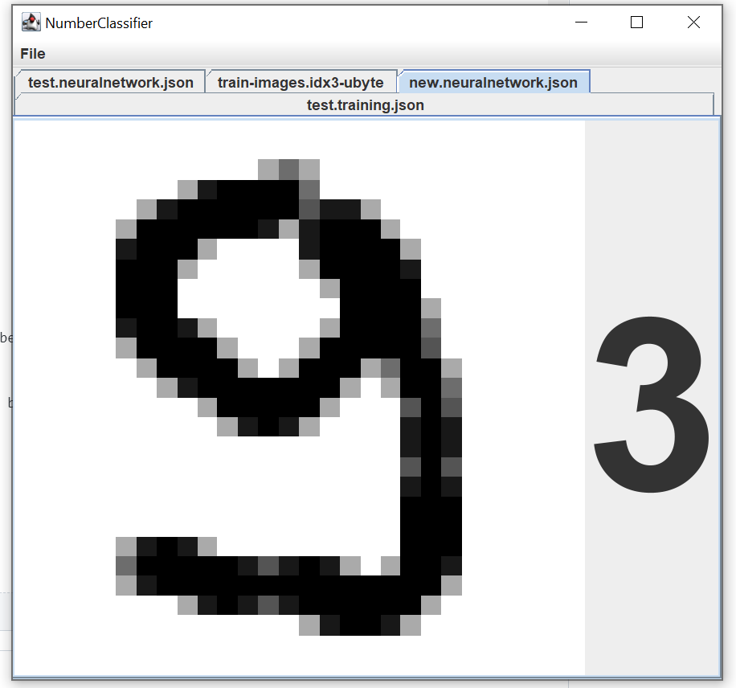
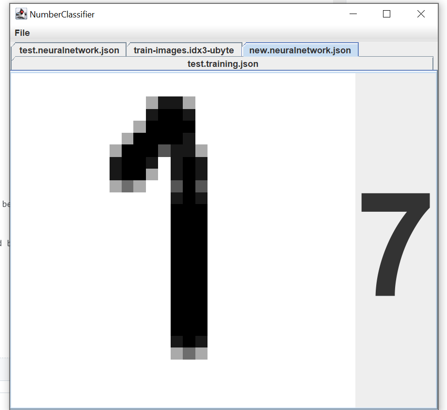
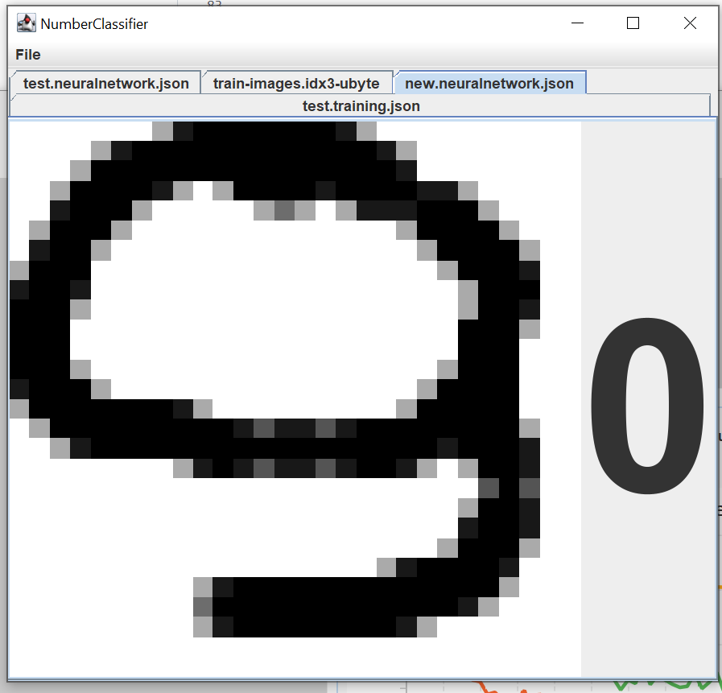

# Test Document

## Unit testing

Auto-generated unit testing code coverage report can be downloaded [here](https://nightly.link/hnen/NumberClassifier/workflows/gradle/master/codecov-report.zip).

I've tried to write unit tests so that they ensure sure smaller parts of the algorithms work correctly. Brief description of tests:

### `ImageSetTest`
- Test that MNIST file format(that is used for the training data) is parsed correctly using a simple hand-made example.
- Test that the images are transformed into `TrainingExample`s correctly. This is needed to input and test the images with neural network.

### `FeedForwardNeuralNetworkTest`
 - Test that the class doesn't accept invalid input.
 - Test with trivial exampe, that feedforward algorithm works correctly. Feedforward is vital for everything to work correctly so this is very important.
 - Test that parameter gradients are calculated correctly. 'Correctness' was slightly harder to define in this case, but unit tests do some sanity checks, like that the gradient signs are towards right direction, and that applying gradients reduce neural network cost function.
 - Test that full training epoch decreases the value of the function. That's what the training, by definition, aims to do.

### `FeedForwardNeuralNetworkParametersTest`
 - Test that primitive operations like addition and weight matrix generation work correctly. This is pretty trivial to test.
 - Test for invalid input.

### `TrainConfigTest`
 - Test that JSON data is parsed properly.

### `NeuralNetworkTrainerTest`
 - Test that trainer is capable of training a trivial classifier network with 100% accuracy.
 - TODO: Test that smaller parts of trainer behaves like it's defined to do, for example: feedforward is called right number of times, mini batches are generated correctly, etc.

### Unit Test Coverage

## Training the neural network

### Input

Hyper Parameters:
- `layers`: Neural network topology. Number of layers and number of neurons on each layer, as an integer array.    
- `activation`: Activation function. Two activation functions were implemented, Sigmoid functions("sigmoid") and Rectified Linear Unit ("relu")
- `initWeightMethod`: Heuristics used to initial values for network weights. Three methods are implemented, "uniform", "xavier" and "hu".
- `initBiases`: Initial value for neuron initial biases.
- `epochs`: Array of number of epoch for each phase of the training. Length of the array defines number of phases.
- `learningRate`: Multiplier for each gradient descent step. Bigger value trains the network faster, but is numerically less stable. The value is an array, which allows specifying different learning rate for each phase.
- `miniBatchSize`: Size of the batch used on every epoch.
- `rmspropMomentum`: Parameter for the RMSprop gradient descent method. Bigger values slows, or 'smoothens,' the change of the gradient along time. Must be in range 0-1.

File parameters:
 - `trainingData`: File containing the number images for training in MNIST format.
 - `trainingLabels`: File containing the corresponding number labels for trainign in MNIST format.
 - `testData`: File containing the number images for testing accuray in MNIST format.
 - `testLabels`: File containing the number labels for testing accuracy in MNIST format.
 - `outFile`: File to output the trained network to in JSON format.

### Measuring perforamance

There are few factors that can be used to measure training performance.

 - Test set accuracy: How big proportion of the images in the test data the trained network managed to guess correctly.
 - Training duration: How long did it take to train the network from start to finish.
 - Loss function evolution: Function of loss value as function of epoch. Can be used to estimate how efficiently the network learns, when does the learning plateau and how stable the learning is.

### Testing method

Testing the training can be done inside the app (see manual for basic usage.) A hyperparameters are chosen, and optimal hyperparameters are searched in ad-hoc fashion.

After every training run, test set accuracy, training duration and loss function evolution are recorded. Accuracy and duration are written in `train-stats.csv` along with the used hyperparameters for replicating the result. Loss function evolution is shown in the UI, and saving is done by manually screenshotting it for now.

Randomized algorithms use fixed seed for now, to make it easier to replicate results.

Finding good metaparameters was a task of its own. Good visualization of loss function evolution and replicatable results was essential in optimizing the parameters. There are certain heuristics that can be used. Learning rate was one of the most important metaparameters to tweak manually.
 - Find largest learning rate that makes the loss function to converge.
 - Observe when the learning rate stabilizes or starts to increase. Adjust number of epochs for this pass accordingly.
 - Decrease the learning rate for following epoch until loss stabilizes again.
 - Repeat

Additionally to this, I aimed to make the network as small as possible and use as small batch size as possible so training and using the network would be fast. With even bigger network I didn't manage to hit higher than 97% accuracy ballpark. It was result I decided to be happy with, considering that reference implementations in  [MNIST database](http://yann.lecun.com/exdb/mnist/) had similar results for methods for trainings not using deskewing or cross-entropy, that I didn't have time to implement.

### Test results

A training run that produced fairly good results had following hyper parameters:

| Hyper paramater          | Value         |
|--------------------------|---------------|
| Layers                   | 784-32-32-10  |
| Activation function      | ReLU          |
| Epochs                   | 7000, 3000    |
| Learning Rates per phase | 0.001, 0.0001 |
| Weight init method       | Uniform       |
| Weight init range        | \[-0.1, 0.1\] |
| RMSprop momentum         | 0.9           |
| Mini batch size          | 32            |

Loss function evolution from the training:

Test set accuracy was **96.84%**

Training duration on my computer was **50,4 seconds** 

## Evaluating hand-written numbers

Even though main focus of this project was in trainign the network, I was interested in testing the evaluation of hand-written numbers, as it is a concrete application for the network.

Correctness for this algorithm is slightly more subjective. One definition could be, that it should be able to identify anyone's hand-written numbers with same accuracy rate than against the MNIST test examples.

Testing the evaluating was done subjectively. I drew 30 numbers and calculated the times the network got them wrong. I used the network trained above. Out of 30 drawings, the app evaluted 3 wrong, resulting in 90% accuracy. Sample size was small, but it looks like the drawing could use some improvement.

Some examples of wrongly evaluated numbers:

## References

 - http://yann.lecun.com/exdb/mnist/
